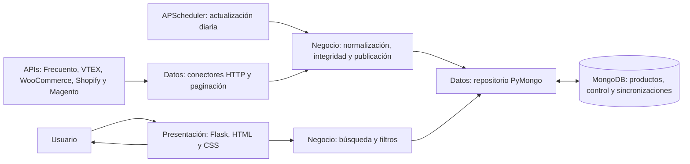
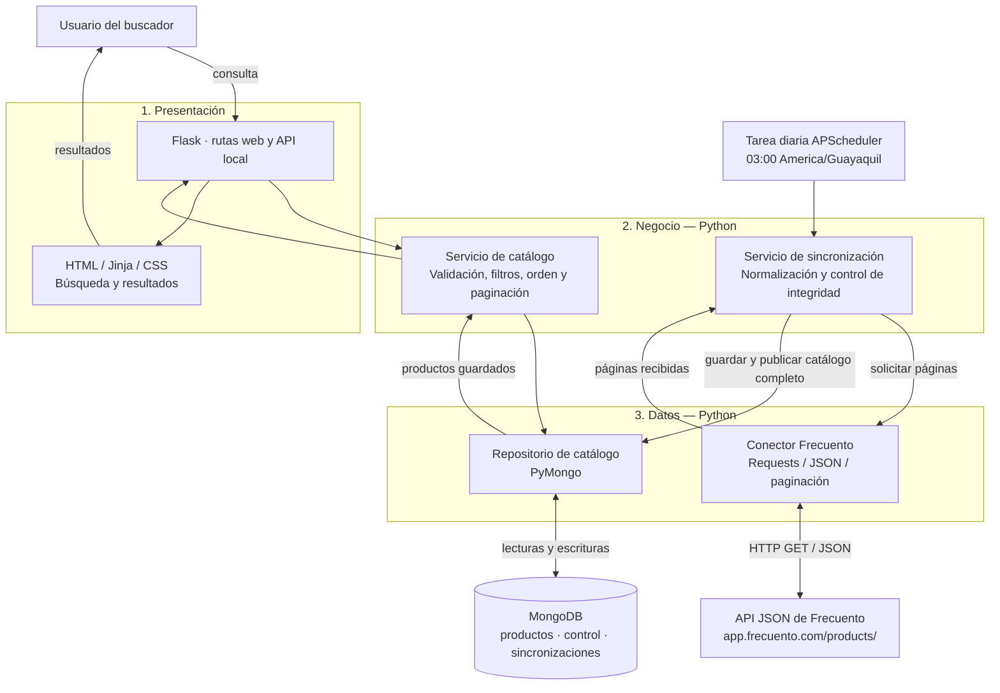
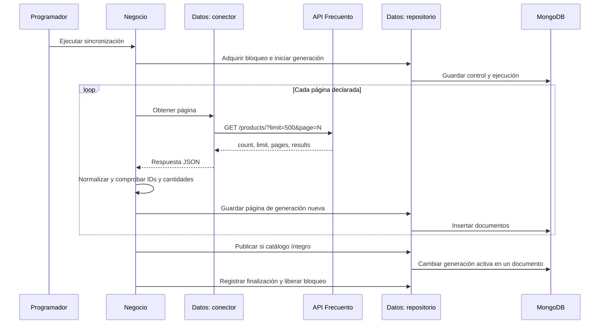
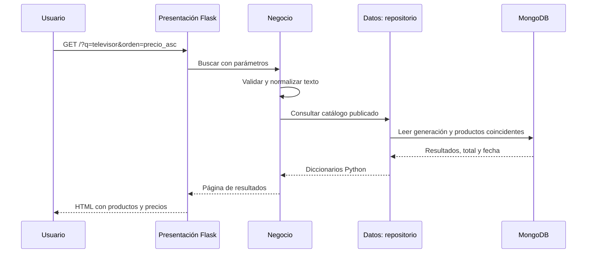

# Arquitectura en tres capas

## Integración actual (17 tiendas)

Cada tienda tiene una generación publicada y un bloqueo independientes. La búsqueda conjunta consulta las generaciones vigentes en MongoDB; el filtro de tienda limita los resultados a una fuente. El proceso programado consulta las APIs y solo publica una generación cuando está completa. La ficha conserva la URL original para abrir el producto en la tienda. Se muestran resultados ordenados por precio, pero todavía no se agrupan automáticamente modelos equivalentes.

Los diagramas siguientes describen el conector original de Frecuento y siguen siendo un ejemplo concreto de las mismas tres capas.

## Componentes y dependencias

La API de Frecuento y MongoDB son sistemas externos a las capas. El programador invoca la capa de negocio. La presentación recibe un servicio que solo tiene acceso al repositorio; no recibe el conector HTTP. Las dependencias se conectan en los puntos de entrada, no dentro de las plantillas.

## Secuencia de actualización

Un error antes de publicar conserva el puntero anterior. No se emplea una transacción de múltiples documentos; la visibilidad del catálogo depende de un cambio atómico en `control`. La generación completa se almacena antes de ese cambio.

## Secuencia de búsqueda

No hay ninguna llamada a Frecuento en esta secuencia. Las imágenes se muestran mediante URL públicas de la fuente, pero el catálogo y los precios proceden de MongoDB.

## Funciones reutilizables

| Función o componente | Responsabilidad |
|---|---|
| `normalizar_texto` | Unificar mayúsculas, espacios y acentos |
| `dinero` | Validar importes decimales |
| `normalizar_producto` | Transformar un producto JSON al modelo local |
| `filtro_busqueda` | Construir filtros de texto escapados |
| `a_bson` / `a_python` | Convertir decimales de forma recursiva |
| `FrecuentoAPI.pagina` | Solicitudes, pausas, reintentos y validación del contrato |
| `RepositorioCatalogo` | Encapsular consultas y escrituras de MongoDB |
| `ServicioSincronizacion` | Recorrer, comprobar y publicar el catálogo |

## Agrupación de modelos equivalentes (pendiente)

Los conectores de las 17 tiendas ya proporcionan productos normalizados. Para comparar ofertas del mismo modelo con precisión todavía se necesita resolver identidades y variantes equivalentes, además de revisar las condiciones de cada precio. El listado actual ordena productos de distintas tiendas por importe y enlaza con sus páginas de origen.
